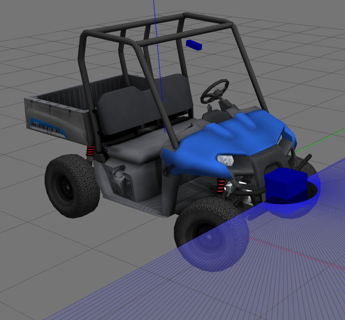

# Разработка модуля управления движением мобильного робота(МР) по траектории
В этой задаче мы будем управлять движением МР в виртуальной среде (Gazebo либо Stage)
В качестве МР выступает модель карта с кинематической схемой автомобиля (Ackerman steering - поворачивающиеся передние колеса)


МР оснащен сканирующим лазерным дальномером и другими датчиками(в Gazebo)

В этой задаче мы не используем данные датчиков, только одометрию и данные о положении робота, которые приходят из симулятора

Управение роботом в этой задаче сводится к управлению поворотом переднего колеса велосипедной модели (топик /steering куда можно отправить желаемый угол поворота руля в рад) и управлению скоростью (топик /velocity куда можно отправить желаемую скорость в м/сек). 

В случае Gazebo за передачу команд управления в модель отвечает vehicle_ros_plugin, а в случае stage команды превращает в управление моделью stage_controller. И в том и в другом случае моделируются ограничения на параметр управления и скорость его изменения (линейное ускорение и скорость вращения рулевого колеса соответственно). То есть если задать угол поворота руля, то он начнет менятся от текущего к заданному с фиксированной скоростью (задается в лонч файле).

Модуль simple_controller реализует управление вдоль заданной траектории, который нужно модернизировать.
Запуск модуля управления с моделью осуществляется с помощью лонч  файла controller_stage.launch для stage
```bash
roslaunch simple_controller controller_stage.launch
```
controller.launch для Gazebo)
```bash
roslaunch simple_controller controller.launch
```
в этом лонче прописан запуск модели с нужными для работы модулями, запуск модуля simple_controller и запуск панели rqt с нужными плагинами, среди которых: задание скорости движения, графики ошибок управления, контролы для настройки регулятора (в текущей реализации).

## Устройство simple_controller
simple_controller управляет движением МР по заданной траектории за счет управления поворотом рулевого колеса (топик /steering). Скорость движения задается извне, в данном случае из rqt (с помощью плагина publish message)
simple_controller реализован в виде класса [Controller](https://github.com/AndreyMinin/MobileRobots/blob/master/mr_ws/src/simple_controller/src/controller.h#L34), часть функций которого является колбеками, вызываемыми библиотекой ros при получении сообщений.
В частности он подписан на сообщения 
- с текущим положением МР [on_pose](https://github.com/AndreyMinin/MobileRobots/blob/master/mr_ws/src/simple_controller/src/controller.cpp#L102)
- с одометрией (получение текущей скорости) [on_odo](https://github.com/AndreyMinin/MobileRobots/blob/master/mr_ws/src/simple_controller/src/controller.cpp#L118)
- обработка таймера [on_timer](https://github.com/AndreyMinin/MobileRobots/blob/master/mr_ws/src/simple_controller/src/controller.cpp#L60), где выполняется вся логика работы модуля: вычислется необходимый угол поворота рулевого колеса в зависимости от положения МР относительно траектории

Модуль публикует:
- управление МР в виде команды поворота переднего колеса с помощью паблишера [steer_pub](https://github.com/AndreyMinin/MobileRobots/blob/master/mr_ws/src/simple_controller/src/controller.cpp#L92)
- текущую ошибку управления (Которую мы можем видеть на графике в rqt) с помощью паблишера [err_pub](https://github.com/AndreyMinin/MobileRobots/blob/master/mr_ws/src/simple_controller/src/controller.cpp#L125)
- траекторию движения в виде облака точек для визуализации в rviz в функции [publish_trajectory](https://github.com/AndreyMinin/MobileRobots/blob/master/mr_ws/src/simple_controller/src/controller.cpp#L181)

### Траектория движения
Траектория движения задается в виде набора сегментов с постоянной кривизной: прямых и дуг окружностей. 
Программно каждый сегмент представлен в виде объектов класса [CircularSegment](https://github.com/AndreyMinin/MobileRobots/blob/master/mr_ws/src/simple_controller/include/trajectory_segment.h#L39) либо [LinearSegment](https://github.com/AndreyMinin/MobileRobots/blob/master/mr_ws/src/simple_controller/include/trajectory_segment.h#L103), являющихся наследниками класса [TrajectorySegment](https://github.com/AndreyMinin/MobileRobots/blob/master/mr_ws/src/simple_controller/include/trajectory_segment.h#L23), что позволяет работать с разными сегментами единым образом.
Каждый сегмент задается некоторой начальной точку, заданной кривизной, длиной и направлением (определяется ориентацией в начальной точке)

В классах сегментах реализованы следующие функции:
- get_length - возвращает длину сегмента 
- get_curvature - возвращает кривизну текущего сегмента
- get_point(double point_len) - возвращает точку (вектор x, y, z) сегмента на заданной длине от начала (т.е. get_point(0.0) - вернет начальную точку сегмента)
- get_point_length(x, y) - вернет длину сегмента до точки, ближайшей к заданной
- get_point_distance(x,y) - вернет расстояние от заданной точки до ближайшей точки сегмента с учетом направления

Траектория задается как [массив(std::list) trajectory из нескольких сегментов](https://github.com/AndreyMinin/MobileRobots/blob/master/mr_ws/src/simple_controller/src/controller.cpp#L274) в конструкторе контроллера. Траектория образует замкнутый овал.

### Текущее устройство контроллера
Модуль управления движением вдоль траектории реализован в виде ПИД регулятора, входом которого является расстояние до ближайшей точки траектории, а выходом желаемый угол управления
Начальное положение МР соответствует начальной точке первого сегмента.
Далее в [таймере](https://github.com/AndreyMinin/MobileRobots/blob/master/mr_ws/src/simple_controller/src/controller.cpp#L60) контроллера
-[update_robot_pose](https://github.com/AndreyMinin/MobileRobots/blob/master/mr_ws/src/simple_controller/src/controller.cpp#L274) - обновляется положение МР с учетом полученных данных (последнее положение + скорость * dt)
- [update_trajectory_segment](https://github.com/AndreyMinin/MobileRobots/blob/master/mr_ws/src/simple_controller/src/controller.cpp#L66)  - обновляем указатель на сегмент траектории, который является ближайшим к положению МР. То есть берем текущий ближайший сегмент, вычисляем с помощью get_point_length длину до ближайшей точки сегмента, если она отрицательная - [надо взять предыдущий сегмент](https://github.com/AndreyMinin/MobileRobots/blob/master/mr_ws/src/simple_controller/src/controller.cpp#L31), если она больше длины текущего сегмента - надо [взять следующий](https://github.com/AndreyMinin/MobileRobots/blob/master/mr_ws/src/simple_controller/src/controller.cpp#L39) 
- вычисляем ошибку - [расстояние до ближайшего сегмента](https://github.com/AndreyMinin/MobileRobots/blob/master/mr_ws/src/simple_controller/src/controller.cpp#L69)
- считаем регулятор угловой скорсти
- пересчитываем угловую скорость в кривизну 
- отправляем кривизну в /stering (здесь небольшое несоответствие, но на самом деле речь просто о коэффициенте - он переходит в коэффициенты регулятора)
- публикуем траекторию
- публикуем текущую ошибку

### Задача
Переделать модуль управления движением вдоль траектории, реализовав один из алгоритмов, описанных на лекции (базовый вариант - pure pursuite алгоритм преследования маяка). Изменения должны коснуться в основном только функции таймера. 